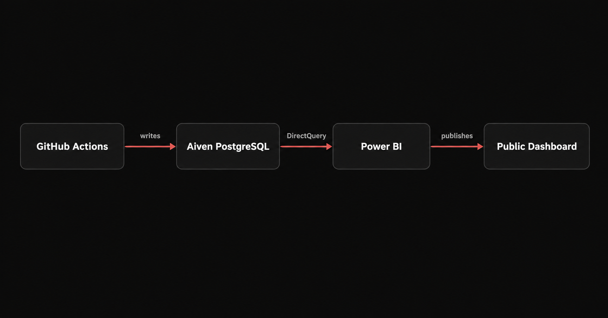
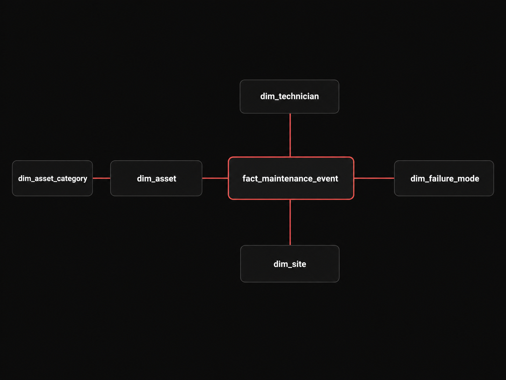

# Vestige

A synthetic field-service data warehouse and analytics platform, built on top of the public **AI4I 2020 Predictive Maintenance Dataset**.

Vestige simulates a field-service maintenance operation — assets, sites, technicians, and maintenance events — using real AI4I sensor-failure data as its statistical foundation, layered with synthetic operational context (asset categories, site locations, technician assignments) to model what a realistic maintenance-analytics pipeline looks like end to end: cloud-hosted warehouse, scheduled ingestion, dimensional modeling, data-quality validation, and a live BI dashboard.



## What this project demonstrates

- Cloud-hosted relational data warehousing (PostgreSQL on Aiven)
- Dimensional (star schema) data modeling, including many-to-many relationships via bridge tables
- ETL/ELT: ingestion, synthetic data generation, validation, and loading
- Scheduled pipeline orchestration (GitHub Actions)
- Data-quality validation enforced at the pipeline level
- BI dashboarding with a live, queryable data source (Power BI + DirectQuery)

## Architecture

```
GitHub Actions  --writes-->  Aiven PostgreSQL  --DirectQuery-->  Power BI  --publishes-->  Public Dashboard
```

A scheduled GitHub Actions workflow generates a small daily batch of synthetic maintenance events and loads them into a PostgreSQL database hosted on Aiven. Power BI connects to that database live via DirectQuery — every chart and card reflects the current state of the warehouse, not a static export.

**Scope note:** the project originally targeted Azure SQL Database and Azure Data Factory. Azure's account-verification flow required a card hold that couldn't be completed, so the warehouse moved to Aiven PostgreSQL (free tier, no card required) and orchestration consolidated onto GitHub Actions alone. The skills being demonstrated — cloud SQL, ETL/ELT, modeling, validation, orchestration, scheduling — are unaffected by the swap. Full reasoning for this and every other design decision is in [`documentation.pdf`](docs/documentation.pdf).

## Data model



A star schema centered on `fact_maintenance_event`, where each row represents a maintenance event performed *after* a failure (not the failure itself):

| Table | Purpose |
|---|---|
| `fact_maintenance_event` | One row per maintenance event |
| `dim_asset` | Synthetic field-service assets |
| `dim_asset_category` | `HVAC`, `ELECTRICAL`, `VERTICAL_TRANSPORTATION`, `HOISTING` |
| `dim_site` | Synthetic Lahore-based service sites |
| `dim_technician` | Synthetic technicians, each with a category specialty |
| `dim_failure_mode` | The five real AI4I failure modes: `TWF`, `HDF`, `PWF`, `OSF`, `RNF` |

Two relationships are many-to-many by design and modeled with bridge tables rather than foreign keys on the fact table directly:

- `asset_category_assignment` — an asset can span more than one category
- `maintenance_event_technician` — an event can involve more than one technician
- `maintenance_event_failure_mode` — an event can involve more than one AI4I failure mode, since the source dataset's failure indicators are independent of each other

Notable modeling decisions: no `dim_date` table (date parts are derived directly in PostgreSQL/Python rather than stored redundantly); derived fields like `last_failure_date` and `maintenance_count` are computed at query time from the fact table instead of duplicated on `dim_asset`; a dedicated `dq_validation_log` table was considered and rejected in favor of validating at the pipeline layer plus PostgreSQL constraints, since GitHub Actions already retains execution logs.

## Data source

[AI4I 2020 Predictive Maintenance Dataset](https://archive.ics.uci.edu/dataset/601/ai4i+2020+predictive+maintenance+dataset) — 10,000 machine records, 339 of which represent an actual failure (`Machine failure == 1`), across five independent failure modes:

- **TWF** — Tool Wear Failure
- **HDF** — Heat Dissipation Failure
- **PWF** — Power Failure
- **OSF** — Overstrain Failure
- **RNF** — Random Failure

These 339 real records seed the historical fact table. Ongoing daily records are synthetically generated in the same statistical shape — preserving the dataset's documented temperature and power/torque relationships — rather than drawn from the finite source file, since AI4I is a static, non-renewing dataset.

## Pipeline

1. **Ingestion** (`src/ingestion/`) — `inspect_ai4i.py` profiles the raw source file (missing values, duplicate rows, failure count, sample rows); `extract_ai4i.py` filters to the 339 real failure records and writes `data/extracted/ai4i_failures.csv`, leaving the raw file untouched.
2. **Generation** (`src/generators/`) — produces synthetic assets, sites, technicians, asset categories, and AI4I-style failure records using `Faker` and weighted randomization, preserving the source dataset's sensor relationships and failure-mode logic.
3. **Validation** (`src/validators/`) — every generated or extracted record is checked (required fields, correct types, valid category/failure-mode values, non-future dates, finite non-negative sensor readings, no duplicate categories) before it's eligible to load.
4. **Loading** (`src/loaders/`) — parameterized inserts into Aiven, including bridge-table relationships.
5. **Seeding** (`src/seeds/`) — orchestrates generate → validate → load per dimension/fact, used for the one-time historical backfill.
6. **Daily automation** (`src/pipelines/daily_ingest.py` + `.github/workflows/`) — a scheduled GitHub Actions workflow generates and loads a small daily batch of new maintenance events (1–5 rows), enforcing a hard 10,000-row scope limit on the fact table appropriate to the project's intentionally small scale. A recovery/backfill pipeline was scoped out, since small batch sizes and the row cap make an occasional missed run insignificant, and GitHub Actions already retains execution history with manual rerun support.

## Dashboard


A Power BI Desktop report connected to Aiven via **DirectQuery** — every visual queries the live warehouse.

- 6 KPI cards: total maintenance events, total sites, total assets, total technicians, total failure-mode occurrences, average technicians per event
- 3 bar charts: failures by site, failures by failure mode, events by technician
- 1 line chart: maintenance events over time
- 5 slicers: failure date (range), site, technician, asset category, failure mode
- Custom dark theme

**Public access:** Power BI's `Publish to Web` doesn't support DirectQuery reports, and the Power BI Service requires a work/school account. Rather than compromise on either the live DirectQuery connection or the DirectQuery-incompatible workarounds, the report is distributed directly:

- [`powerbi/vestige.pbix`](powerbi/vestige.pbix) — open in the free Power BI Desktop app (no account required) to interact with the dashboard live against Aiven
- [`powerbi/vestige_report.pdf`](powerbi/vestige_report.pdf) / [`powerbi/vestige_report.png`](powerbi/vestige_report.png) — static high-resolution export for a quick look without installing anything

A dedicated read-only PostgreSQL role, `vestige_reader`, is provided for anyone opening the `.pbix` — connection details are in [`.env.example`](.env.example). It holds `SELECT` only (verified against every table, no `INSERT`/`UPDATE`/`DELETE`, no replication, no superuser) and is safe to share publicly.

## Repository structure

```
vestige-data-engineering/
├── data/
│ ├── raw/
│ │ └── ai4i2020.csv
│ └── extracted/
│ └── ai4i_failures.csv
├── docs/
│ ├── architecture_diagram.png
│ └── schema_diagram.png
│ ├── documentation.docx
│ └── documentation.pdf
├── powerbi/
│ ├── vestige.pbix
│ ├── vestige_report.pdf
│ └── vestige_report.png
├── src/
│ ├── init.py
│ ├── constants.py
│ ├── ingestion/
│ │ ├── init.py
│ │ ├── inspect_ai4i.py
│ │ └── extract_ai4i.py
│ ├── generators/
│ │ ├── init.py
│ │ ├── ai4i.py
│ │ ├── technician.py
│ │ ├── site.py
│ │ └── ... # asset, asset_category, failure_mode
│ ├── validators/
│ │ ├── init.py
│ │ ├── ai4i.py
│ │ ├── asset.py
│ │ ├── asset_category.py
│ │ └── ... # failure_mode, site
│ └── ... # loaders, seeds, pipelines, db
├── .env.example
└── ... # requirements.txt, LICENSE, main.py
```

## Getting started

```bash
git clone <repo-url>
cd vestige-data-engineering
python -m venv .venv
.venv\Scripts\activate        # or source .venv/bin/activate on macOS/Linux
pip install -r requirements.txt
cp .env.example .env          # fill in your own Aiven admin credentials
```

Create the schema and backfill the warehouse:

```bash
python -m src.db.schemas.create
python -m src.seeds.asset_categories
python -m src.seeds.failure_modes
python -m src.seeds.assets
python -m src.seeds.sites
python -m src.seeds.technicians
python -m src.seeds.fact
```

The daily ingest pipeline runs automatically via the GitHub Actions workflow once the Aiven connection secrets are configured in the repository settings — no manual step required going forward.

To view the dashboard: open `powerbi/vestige.pbix` in [Power BI Desktop](https://www.microsoft.com/en-us/power-platform/products/power-bi/downloads) and, when prompted for credentials, use the `vestige_reader` details from `.env.example`.

## Tech stack

Python 3.13 · PostgreSQL (Aiven) · psycopg · pandas · Faker · GitHub Actions · Power BI Desktop

## Full build history

Every decision above — including ones that were tried and reversed — is documented in full in [`documentation.pdf`](docs/documentation.pdf).

## License

See [`LICENSE`](LICENSE).